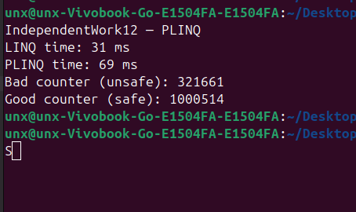

    Звіт до Самостійної роботи №12

**Тема:** PLINQ: дослідження продуктивності та безпеки
Студент: Шах Святослав, ІПЗ 3/1

**1. Мета роботи**

Метою роботи було дослідити роботу PLINQ у порівнянні зі звичайним LINQ, перевірити його продуктивність на великій колекції даних та розібратись із типовими проблемами потокобезпеки, які виникають при паралельній обробці елементів.

    2. Проведені експерименти

Для експериментів я створив список з 2 мільйонів випадкових чисел.
Обчислювальну операцію вибрав навмисно повільнішу — перевірку числа на простоту, щоб було помітно навантаження на процесор.

Одна й та сама операція виконувалась двома способами:

через звичайний LINQ

через PLINQ (AsParallel())

Час вимірював через Stopwatch.

    3. Результати продуктивності

Під час запуску програми я отримав такі значення:

LINQ: 31 ms

PLINQ: 69 ms

Таким чином, у моєму випадку PLINQ виявився повільнішим, навіть попри те, що операція над елементом не була зовсім тривіальною.

Причина в тому, що паралелізація має свій оверхед — створення потоків, передача роботи, синхронізація. Якщо обчислення недостатньо “важкі”, то витрати на розпаралелювання перевищують саму користь.

У моєму експерименті колекція хоч і велика, але перевірка на простоту в середньому проходила досить швидко. Тому PLINQ не встиг компенсувати службові витрати і програв у швидкості.

    4. Побічні ефекти в PLINQ

Другий експеримент був пов’язаний із потокобезпечністю.
Я спеціально обробляв колекцію в PLINQ і змінював одну спільну змінну.

**Результати:**

    Небезпечний варіант (без lock) показав значно меншу кількість, ніж реальна.
Це пояснюється гонкою потоків — кілька потоків одночасно змінювали один і той самий лічильник, і частина інкрементів просто губилася.

Після додавання lock результат став правильним, але при цьому PLINQ втрачає перевагу у швидкості, бо синхронізація блокує паралельність.

    5. Аналіз та висновки

У ході виконання роботи вдалося побачити реальні особливості PLINQ:
PLINQ не завжди швидший. У моєму вимірюванні він навіть був у 2 рази повільнішим за звичайний LINQ. Це нормально для операцій середньої “важкості”, коли накладні витрати паралелізації більші за вигоду. Паралельний код небезпечний при зміні спільних змінних. Значення badCounter показує, що PLINQ без синхронізації дає неправильні результати.

**Для коректної роботи зі спільним станом потрібен lock або інша потокобезпечна структура. Але через це PLINQ частково втрачає сенс, бо блокування зменшують масштабування.**

    PLINQ корисний тоді, коли:

1) даних дуже багато (десятки мільйонів); 
2) операція над елементом дуже важка;
3) немає спільних змінних та побічних ефектів.

В інших випадках звичайний LINQ може працювати не гірше, а інколи — навіть швидше, що підтвердили отримані мною результати.