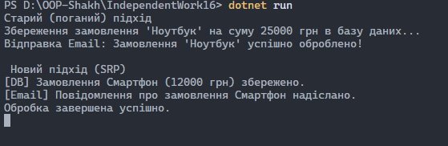
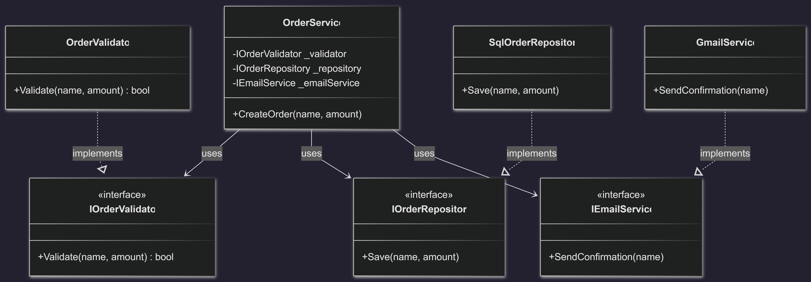

# Самостійна робота №16

**Тема: Схема розподілу відповідальностей модуля (SRP)**

**Студент:** Шах Святослав  
**Група:** ІПЗ 3/1  
**Дата:** 26.01.2026  

## 1. Мета роботи
Метою роботи було навчитися застосовувати принцип єдиної відповідальності (**Single Responsibility Principle — SRP**) для декомпозиції складних систем. Я опанував навички розділення великого "God Object" на дрібні, спеціалізовані класи та візуалізацію структури проєкту за допомогою UML-діаграм.

## 2. Реалізація (Варіант №1: OrderProcessor)
У ході роботи я пройшов через два етапи розробки:

### Етап 1: "Поганий" клас (BadOrderProcessor)
Спочатку було створено клас, який грубо порушує SRP. Він одночасно займався:
* Перевіркою вхідних даних (валідація).
* Логікою збереження даних у базу.
* Відправкою поштових сповіщень.
Такий підхід робить код важким для тестування та підтримки.

### Етап 2: Рефакторинг
Я провів декомпозицію логіки, виділивши три окремі інтерфейси та їх реалізації:
1. **IOrderValidator**: Тільки перевірка коректності замовлення.
2. **IOrderRepository**: Тільки робота з даними (збереження).
3. **IEmailService**: Тільки зовнішні комунікації.

Головний клас `OrderService` тепер не знає деталей реалізації кожного етапу, а лише координує роботу через інтерфейси (**Dependency Inversion Principle**).

## 3. Результати
В результаті рефакторингу код став модульним. У методі `Main` продемонстровано роботу обох підходів. Нова реалізація дозволяє, наприклад, замінити SQL-сховище на хмарне або змінити сервіс розсилки, не чіпаючи логіку обробки замовлення.

## 4. Висновки
Я навчився виявляти порушення SRP та виправляти їх за допомогою інтерфейсів. Декомпозиція допомагає зробити систему гнучкою: кожен клас тепер має лише одну причину для зміни. Також я опанував інструменти для створення UML-діаграм, що дозволяє краще планувати архітектуру до початку написання коду.

---

## Контрольні питання

**1. Поясніть принцип єдиної відповідальності (SRP). Чому він важливий?** SRP означає, що кожен клас повинен відповідати лише за одну частину функціональності. Це важливо, бо зменшує ризик того, що зміна в одній функції (наприклад, форматі Email) поламає іншу (наприклад, розрахунок ціни).

**2. Що таке “God Object” і як він порушує SRP?** Це клас, який намагається робити все в програмі. Він порушує SRP, бо має занадто багато причин для зміни, що робить його заплутаним і нестабільним.

**3. Як декомпозиція допомагає дотримуватися SRP?** Вона дозволяє розбити "монолітний" код на незалежні компоненти. Наприклад, винесення валідації в окремий клас дозволяє використовувати її повторно в інших місцях і тестувати окремо від бази даних.

**4. Як діаграми класів (UML) допомагають аналізувати розподіл відповідальностей?** Вони візуально показують зв'язки між об'єктами. Якщо на діаграмі до одного класу веде занадто багато стрілок або він має забагато методів, це сигнал, що його треба розділити.