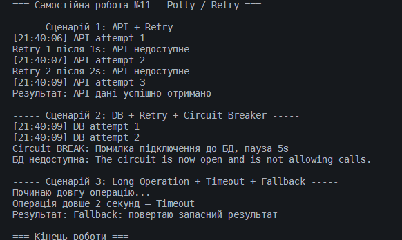

**Самостійна робота №11**

**Тема:** кейси застосування Polly (Retry, Timeout, Circuit Breaker).

**Студент:** Шах Святослав, ІПЗ 3/1.

**Мета роботи**

Розібратись, як у .NET можна робити застосунки більш стійкими до помилок за допомогою бібліотеки Polly.
Перевірити на практиці, як працюють основні політики — Retry, Timeout, CircuitBreaker, Fallback.
Імітувати реальні ситуації, де можуть виникати збої, та подивитись, як Polly з ними справляється.

**Опис виконання**

У роботі я реалізував три різні сценарії. Усі вони запускаються послідовно в Program.cs, щоб було видно логіку і реакцію Polly у консолі.

**1. Проблема: нестабільний зовнішній API**

У цьому сценарії імітував ситуацію, коли API перші декілька разів повертає помилку.
Я зробив лічильник, і поки він ≤2 — метод кидає HttpRequestException.
Для цього обрав Retry з експоненційною затримкою, бо така стратегія найчастіше використовується в реальних системах.

Політика повторює запит 3 рази, а логування показує кожну спробу й причину помилки.
Після кількох невдач API “відповідає нормально”, що дозволяє побачити як Retry доводить дію до успіху.

**2. Проблема: збій при доступі до бази даних**

Імітував помилки підряд при зверненні до БД.
У реальних сервісах база може бути перевантажена або тимчасово недоступна. Тут використав Retry + CircuitBreaker. Retry пробує кілька разів, а Breaker вимикає нові спроби, якщо помилок забагато.
У логах видно момент, коли Breaker переходить у стан "open" і блокує запити на певний час. Це корисно, щоб не перевантажувати сервіс постійними повторними зверненнями.

**3. Проблема: занадто довга операція**

Тут перевіряв, як Polly реагує на операції, які виконуються надто довго. Я змусив метод спеціально “висіти” кілька секунд.

Політика складається з Timeout + Fallback:

Timeout скасовує дію, якщо вона затягнулась. Fallback повертає запасний результат, щоб програма не падала. У консолі видно, як Timeout обриває операцію, а Fallback спрацьовує замість неї.

**Що показав код**

Під час запуску всі сценарії логують:

1. номер спроби

2. тип помилки

3. час затримки

4. стан CircuitBreaker

**фінальний результат виконання**

Завдяки цьому легко побачити як Polly працює всередині — що саме вона повторює, що блокує, і як реагує на помилки.

**Висновки**

Після виконання роботи стало зрозуміло, що Polly суттєво спрощує підхід до обробки нестабільних операцій. Retry, Timeout і CircuitBreaker покривають більшість можливих проблем у мережевих запитах, роботі з API та базами даних. Замість ручних try-catch з циклом, можна в кілька рядків описати політику повторів або поведінку при збої. Це робить застосунок більш стабільним і дозволяє зрозуміло контролювати логіку помилок. Polly активно використовують у мікросервісах, і після цієї роботи стало зрозуміло чому — бібліотека справді дуже зручна.