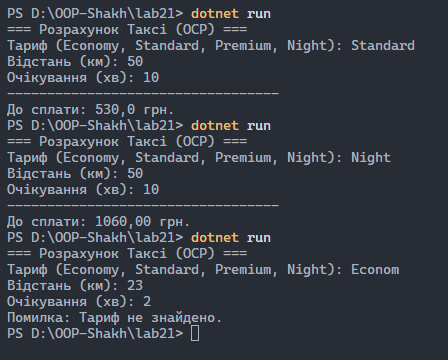

# Звіт до лабораторної роботи №21

**Тема: OCP: гнучкі алгоритми розрахунку (Factory/Strategy)**

**Студент:** Шах Святослав  
**Група:** ІПЗ 3/1  
**Дата:** 26.01.2026  

## 1. Мета роботи
Метою цієї роботи було практичне застосування принципу відкритості/закритості (Open/Closed Principle) з набору SOLID. Я мав навчитися реалізовувати гнучку систему розрахунків, використовуючи комбінацію патернів **Strategy** (для розмежування алгоритмів) та **Factory Method** (для зручного створення об'єктів). Це дозволяє додавати нові типи розрахунків без зміни вже написаного та протестованого коду.

## 2. Реалізація
Для виконання завдання я обрав варіант зі **Службою таксі**. Проєкт було розділено на кілька логічних блоків для дотримання чистоти коду:

* **ITaxiStrategy**: Інтерфейс, який визначає спільний "контракт" для всіх тарифів. Кожна стратегія повинна реалізувати метод `CalculatePrice`.
* **Конкретні стратегії**: 
    * `EconomyTaxiStrategy` — бюджетний тариф.
    * `StandardTaxiStrategy` — базовий тариф.
    * `PremiumTaxiStrategy` — дорогий тариф з фіксованою ціною за подачу авто.
* **TaxiFactory**: Клас, що реалізує фабричний метод. Він відповідає за створення об’єкта потрібної стратегії на основі текстового запиту (наприклад, "economy").
* **TaxiCalculator**: Клас-контекст. Він не містить формул розрахунку, а лише викликає метод у тієї стратегії, яку йому передали. Це забезпечує незалежність логіки сервісу від конкретних реалізацій тарифів.

**Демонстрація OCP**: Для перевірки гнучкості системи я додав клас `NightTaxiStrategy` (подвійний тариф). Для його впровадження не знадобилося змінювати код у `TaxiCalculator` чи `Program.cs`. Я лише створив новий клас і додав один `case` у фабрику.

## 3. Результати
Програма працює в консольному режимі. Користувач обирає тариф, вводить відстань та час простою, після чого отримує розрахунок.

**Основні сценарії:**
1. Вибір стандартного тарифу — розрахунок за базовими коефіцієнтами.
2. Вибір нічного тарифу — демонстрація того, що нова стратегія працює в загальній системі.
3. Введення неіснуючого тарифу — обробка помилки через перевірку на `null` після фабрики.

## 4. Висновки
Під час виконання лабораторної роботи я навчився розділяти відповідальність між класами. Використання патерну **Strategy** дозволило позбутися громіздких конструкцій `if-else` всередині логіки розрахунку, а **Factory Method** допоміг приховати деталі створення об'єктів від клієнтського коду. Це зробило архітектуру програми масштабованою та відповідною принципу OCP.

---

## Відповіді на запитання
1. **У чому суть принципу OCP?** Класи мають бути відкриті для розширення (можна додавати новий функціонал), але закриті для модифікації (не можна змінювати існуючий робочий код).
2. **Навіщо тут патерн Strategy?** Щоб винести різні алгоритми розрахунку в окремі класи, які можна легко замінювати під час виконання програми.
3. **Яку роль відіграє Factory Method?** Він централізує логіку створення об'єктів. Замість того, щоб писати `new` у всьому коді, ми звертаємося до фабрики.
4. **Як перевірити дотримання OCP у цьому проєкті?** Якщо ми можемо додати 5-й або 10-й тариф, не торкаючись коду класу `TaxiCalculator`, значить принцип дотримано.