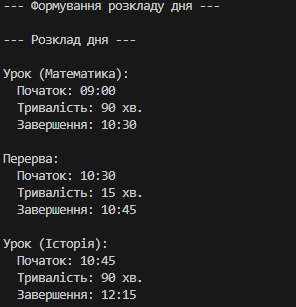

Звіт до лабораторної роботи №3
Дата: 30 вересня 2025 року
Шах Святослав ІПЗ 3/1
Тема: Наслідування: основи

Опис роботи:
Ця лабораторна робота була присвячена реалізації двох похідних класів. Метою було створити клас із такими вимогами:
конструктори з викликом base(...),

перевизначення методів (virtual/override),

демонстрацію поліморфізму на колекції об’єктів.

Результати:

Висновки:
Лабораторна робота дозволила поглибити знання з C# щодо роботи з масивами, індексаторами та перевантаженням операторів. Успішне вирішення проблем свідчить про правильне розуміння концепцій ООП.

Примітки:
Код завантажено до репозиторію Git з додаванням звіту та оновленим .gitignore для ігнорування тимчасових файлів (bin/, obj/).