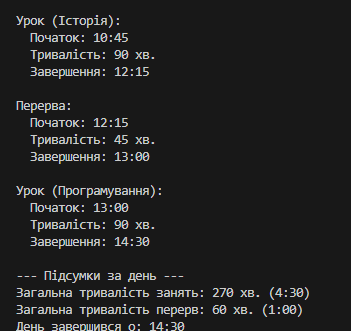

Звіт до лабораторної роботи №3
Тема: Успадкування, Поліморфізм та Перевизначення Методів у C#
Дата: [03.10]
Студент: Шах Святослав іПЗ 3/1

1. Мета Роботи
Метою було практично застосувати принципи Успадкування та Поліморфізму в C#. Завдання включало створення абстрактного базового класу, реалізацію похідних класів з викликом base(...) у конструкторах та демонстрацію динамічного зв'язування через перевизначення методів (abstract/ virtual/override) на колекції об'єктів.

2. Опис Реалізації
Класи та Успадкування
Базовий клас: TimeSpanBase (абстрактний). Він керує часом початку (StartTime) та тривалістю (Duration) інтервалу. Містить абстрактний метод GetDuration() та віртуальний метод GetIntervalType().

Похідні класи:

LessonTime: Представляє урок. У конструкторі використовує base(startTime) і має фіксовану тривалість.

BreakTime: Представляє перерву. У конструкторі використовує base(startTime) і приймає змінну тривалість перерви.

Поліморфізм та Перевизначення
Обидва похідні класи реалізують абстрактний метод override public TimeSpan GetDuration(), встановлюючи свою специфічну тривалість.

Обидва класи перевизначають віртуальний метод override public string GetIntervalType(), щоб коректно відображати свій тип (наприклад, "Урок (Математика)" або "Перерва").

Демонстрація Поліморфізму:
У методі Main() створено колекцію List<TimeSpanBase>. До цієї колекції додано об'єкти LessonTime та BreakTime. При ітерації колекції (foreach) та виклику методу item.DisplayInfo(), відбувається динамічне визначення типу об'єкта, що призводить до виклику коректних перевизначених методів (GetDuration() та GetIntervalType()) для кожного елемента.

3. Результати
Приклади Запуску
[Вставити скріншот консольного виводу програми. Скріншот має чітко показувати: відображення кожного інтервалу (через поліморфний виклик DisplayInfo()) та підсумкові розрахунки (загальна тривалість занять і перерв).]

Висновки
Лабораторна робота успішно виконана. На прикладі розкладу дня продемонстровано:

Ефективне успадкування та ініціалізацію базових полів через base(...).

Застосування abstract, virtual та override для створення гнучкої ієрархії методів.

Поліморфізм, який дозволив уніфіковано обробляти різні інтервали часу (LessonTime та BreakTime) через посилання на базовий тип (TimeSpanBase).