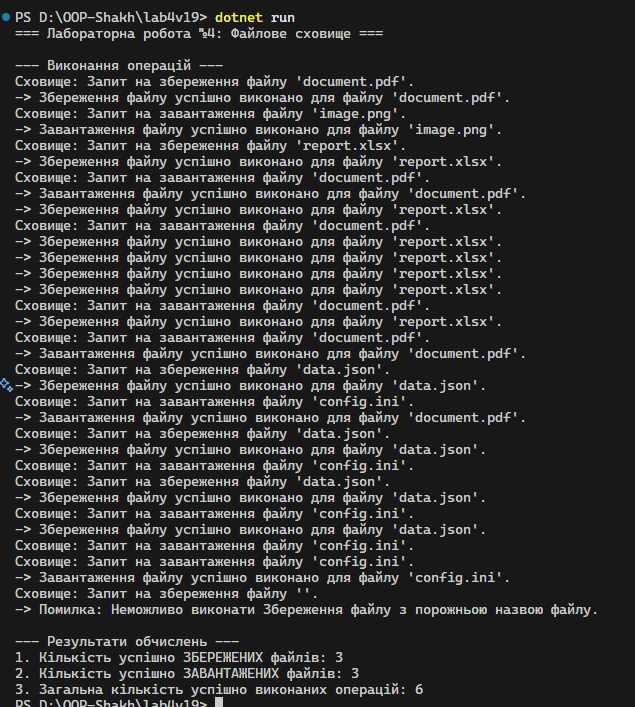

# Звіт до лабораторної роботи №4
**Тема:** Абстракції та інтерфейси. Композиція та агрегація
Дата: [21.10]
Студент: Шах Святослав ІПЗ 3/1

**1. Мета Роботи**
Метою роботи було набути практичних навичок у використанні ключових принципів об'єктно-орієнтованого програмування в C#: Абстракції, Інтерфейсів, а також навчитися створювати зв'язки між класами за допомогою Композиції та Агрегації. Зокрема, реалізувати функціонал файлового сховища, демонструючи гнучкість і повторне використання коду.

**2. Опис Реалізації**
Створено інтерфейс IFileOperation як контракт для всіх файлових операцій (метод Execute і властивість OperationName). Реалізовано абстрактний клас FileOperationBase, який містить спільну логіку: статичний лічильник TotalOperationsCount і захищений метод PerformOperation для імітації успіху/невдачі.

Створено дві конкретні реалізації: FileSave та FileLoad, які успадковують FileOperationBase. Кожен клас перевизначає абстрактні члени та містить власний статичний лічильник (SaveCount або LoadCount) для ведення спеціалізованої статистики.

Агрегація. Реалізовано клас-контейнер FileStorage, який демонструє Агрегацію. Замість створення об'єктів FileSave та FileLoad всередині себе, FileStorage приймає ці об'єкти (через інтерфейс IFileOperation) через свій конструктор (принцип Dependency Injection). Це забезпечує слабке зв'язування, оскільки сховище залежить лише від контракту, а не від конкретних класів.

Обчислення. У методі Main() ініціалізовано об'єкти, пов'язані агрегацією, і виконано серію імітованих операцій. Для перевірки гнучкості та коректності логіки виведено три ключові метрики, використовуючи статичні властивості: кількість збережених (FileSave.SaveCount), кількість завантажених (FileLoad.LoadCount) та загальну кількість успішних операцій (FileOperationBase.TotalOperationsCount).

# 3. Результати: 

# Висновки 
Лабораторна робота успішно виконана. Було продемонстровано ефективне використання Абстракції (інтерфейс та абстрактний клас) та Поліморфізму для створення гнучкої ієрархії. Застосування Агрегації (передача залежностей через конструктор) забезпечило слабке зв'язування між класами, що є ключовим принципом ООП. Усі необхідні обчислення та статистичний облік операцій реалізовано коректно.