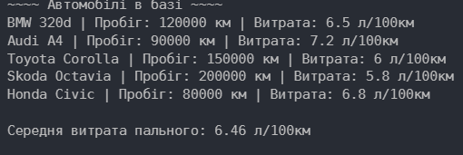

**Звіт до лабораторної роботи №6**
Тема: Делегати, лямбда-вирази та функціональний стиль
Студент: Шах Святослав
Група: ІПЗ 3/1
Дата: 26.11.2025

**1. Мета роботи**

Метою роботи було повторити і закріпити поняття делегатів, анонімних функцій та лямбда-виразів, але вже у контексті мови C++.
Також потрібно було навчитися застосовувати лямбди разом зі стандартними алгоритмами STL, такими як sort, find_if, accumulate, і виконати обробку колекції об’єктів.

**2. Реалізація**

За варіантом №9 я реалізував невелику програму, яка працює з даними про автомобілі.
Було створено клас Car, який містить модель, пробіг та витрату пального. Для роботи з колекцією автомобілів я використав вектор vector<Car>.

Основні частини роботи:

– Для обчислення середньої витрати пального використав std::function разом із лямбда-виразом. Усередині використана функція accumulate, яка сумує витрату пального всіх машин.

– Пошук авто з мінімальною та максимальною витратою реалізував за допомогою min_element та max_element. Обидві функції працюють із лямбда-компаратором, який порівнює витрату.

– Для вибору машин, що мають пробіг понад 100000 км, використав просту лямбду, яка повертає true або false. Це фактично аналог Predicate у C#.

– Для виведення машин у консоль використав лямбду, яка працює як "дія" над кожним елементом.

– Також додав анонімну лямбду-функцію, яка вибирає економні авто (витрата менше ніж 6.5).

Уся логіка виконується в main(), де створюється колекція машин, виконуються всі обчислення і виводяться результати.

** 3. Результати **

Після запуску програми отримані такі результати:

Всі операції були виконані за допомогою лямбд та STL-функцій.

**Висновки**

У ході роботи я попрактикувався у використанні лямбда-виразів у C++ та в інтеграції їх зі стандартними алгоритмами. Хоча у C++ немає делегатів у тому вигляді, як у C#, поєднання std::function та лямбд дозволяє досягти такого ж результату.

Мені вдалося виконати всі вимоги варіанту: обчислити середні показники, відібрати елементи за умовами, знайти мінімальні та максимальні значення та зробити форматований вивід. Програма працює коректно.

**Відповіді на питання**

– Що таке делегат у C++?
У C++ делегатами можна вважати вказівники на функції, лямбда-вирази та std::function. Вони дозволяють передавати функції як параметри.

– Для чого потрібні лямбда-вирази?
Щоб створювати маленькі функції “на місці”, без необхідності оголошувати окремий метод. Їх зручно передавати у алгоритми STL.

– Що таке predicate у C++?
Це будь-яка функція або лямбда, яка повертає bool. Використовується у find_if, remove_if, count_if і т.д.

– Як у C++ замінюється LINQ?
Через sort, find_if, transform, accumulate, copy_if та інші алгоритми STL. Вони працюють схоже на LINQ, але синтаксис інший.

– Чому лямбди зручні?
Тому що вони компактні, можуть захоплювати змінні і легко передаються як параметри, не займаючи багато місця в коді.