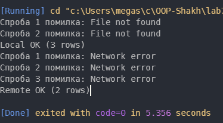

**Звіт до лабораторної роботи №7**

**Тема: обробка IO та мережевих помилок, реалізація retry**

Студент: Шах Святослав
Група: ІПЗ 3/1
Дата: 27.11.2025

**1. Мета роботи**

Метою цієї лабораторної було розібратись, як у С++ можна обробляти помилки, повʼязані з читанням файлів та мережевими операціями, і реалізувати свій варіант механізму повторних спроб. Це потрібно для того, щоб програма не падала відразу при тимчасових збоях, а могла автоматично пробувати виконати дію ще раз через певний час.

**2. Реалізація**

Я зробив три основні частини. Перша — FileProcessor. Він імітує читання дампу з “бази”. Перші дві спроби метод навмисно кидає помилку, ніби файлу не існує, а потім повертає нормальний результат. Друга частина — NetworkClient, який працює так само, але з імітацією мережевих збоїв. Перші три спроби кидається виняток “Network error”, після чого повертаються дані.

Головна логіка retry знаходиться в класі RetryHelper. У ньому є шаблонний метод, який приймає операцію у вигляді лямбди. Якщо виникає помилка, вона виводиться у консоль, після чого робиться затримка, і програма пробує ще раз. Затримка кожного разу збільшується, тому що використовується експоненційне множення. Також є функція shouldRetry, яка відповідає за те, чи треба повторювати конкретний виняток.

У main() я показав роботу для двох ситуацій. Спочатку викликається метод з FileProcessor з кількома невдалими спробами, а потім аналогічно NetworkClient. Коли число помилок закінчується, програма показує, що операція виконана успішно.

**3. Результати**

**4. Висновки**

За цю роботу я навчився використовувати механізм винятків у С++ для обробки помилок, повʼязаних із файлами та мережею. Реалізував базову, але робочу версію патерну retry з експоненціальною затримкою. Це дозволяє програмі бути більш стабільною. Всі вимоги варіанту були виконані, і логіка retry працює так, як очікується.

**Відповіді**

Найчастіше помилки у файлах — це відсутність файлу, проблеми з доступом або пошкоджені дані. У мережі зазвичай бувають збої з’єднання та недоступність сервера.
Retry варто використовувати при тимчасових збоях, які можуть “самолікуватися” при повторній спробі.
Експоненційну затримку можна зробити множенням початкової затримки на 2 після кожної спроби.
Функція shouldRetry потрібна для того, щоб програма могла вирішувати, чи варто повторювати конкретний тип помилки, чи краще відразу зупиняти виконання.